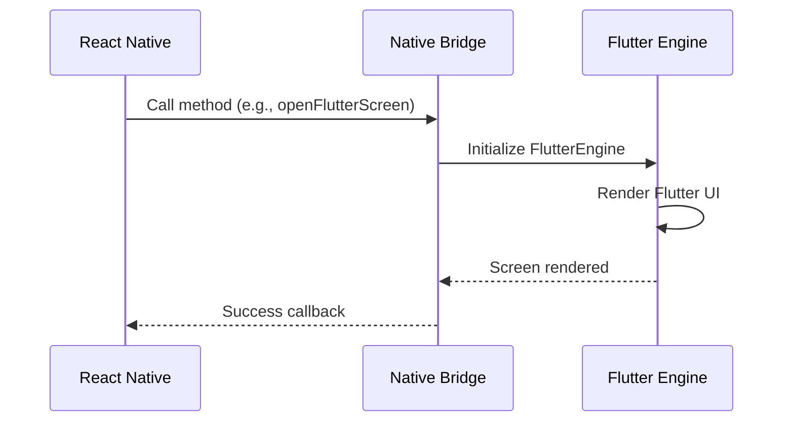
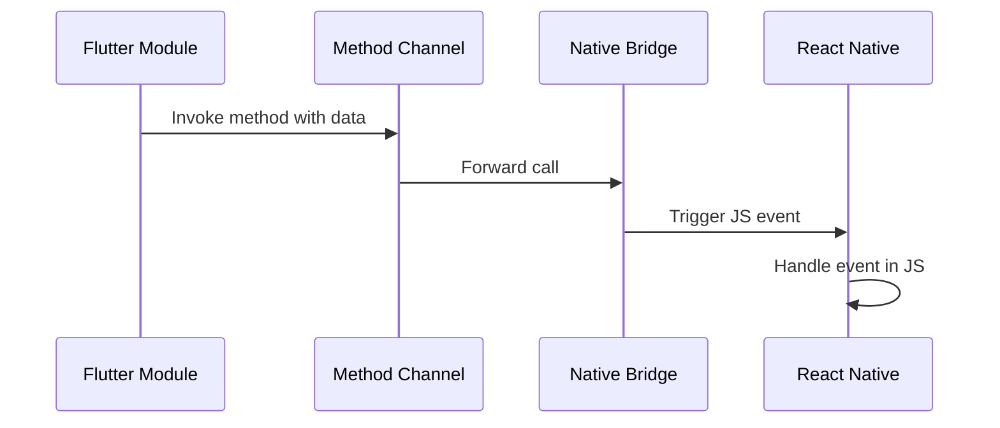

# 🏗️ Arquitetura do Projeto

Este documento detalha a arquitetura do projeto de integração Flutter + React Native.

## 📊 Visão Geral

O projeto é estruturado em três camadas principais que se comunicam através de pontes nativas (bridges):

```
┌─────────────────────────────────────────────────────────────┐
│                    APLICAÇÃO REACT NATIVE                    │
│                                                              │
│  ┌────────────────────────────────────────────────────┐    │
│  │              React Native Layer (JS/TS)            │    │
│  │  - Componentes React                                │    │
│  │  - Lógica de negócio                                │    │
│  │  - Gerenciamento de estado                          │    │
│  └────────────────────┬───────────────────────────────┘    │
│                       │                                      │
│                       ▼                                      │
│  ┌────────────────────────────────────────────────────┐    │
│  │             Native Bridge Interface                 │    │
│  │  - RnLoginSdk.mm (iOS - Objective-C++)            │    │
│  │  - RnLoginSdkModule (Android - Kotlin/Java)       │    │
│  │  - Method Channel / Event Channel                   │    │
│  └────────────────────┬───────────────────────────────┘    │
│                       │                                      │
└───────────────────────┼──────────────────────────────────────┘
                        │
                        ▼
┌─────────────────────────────────────────────────────────────┐
│                    FLUTTER ENGINE                            │
│                                                              │
│  ┌────────────────────────────────────────────────────┐    │
│  │              Flutter Framework Layer                │    │
│  │  - Flutter Widgets                                  │    │
│  │  - Material Design                                  │    │
│  │  - Cupertino (iOS style)                            │    │
│  └────────────────────┬───────────────────────────────┘    │
│                       │                                      │
│                       ▼                                      │
│  ┌────────────────────────────────────────────────────┐    │
│  │          Application Layer (Dart)                   │    │
│  │  - Screens (UI)                                     │    │
│  │  - Widgets (Components)                             │    │
│  │  - Provider (State Management)                      │    │
│  │  - Services (API, Storage)                          │    │
│  │  - Models (Data Structures)                         │    │
│  └─────────────────────────────────────────────────────┘   │
│                                                              │
└─────────────────────────────────────────────────────────────┘
```

## 📂 Estrutura de Diretórios

### Root Level
```
desenvolvimento-hibrido/
├── android/              # Código nativo Android do SDK
├── ios/                  # Código nativo iOS do SDK
├── src/                  # Código TypeScript do SDK React Native
├── rn_flutter_sdk/      # Módulo Flutter completo
├── example/             # Aplicação de exemplo/demo
├── scripts/             # Scripts de automação
└── lib/                 # Output compilado (gerado automaticamente)
```

## 🔧 Componentes Principais

### 1. React Native SDK (`/src`)

**Responsabilidade:** Interface JavaScript/TypeScript para o módulo Flutter

**Estrutura:**
```typescript
src/
├── index.tsx              # API pública exportada
├── NativeRnLoginSdk.ts    # Interface do módulo nativo
└── __tests__/             # Testes unitários
```

**Fluxo:**
1. Componente React importa o SDK
2. Chama métodos JavaScript
3. Métodos são mapeados para chamadas nativas

### 2. Native Bridge (`/ios` e `/android`)

#### iOS (`/ios`)
```
ios/
├── RnLoginSdk.h           # Header Objective-C
└── RnLoginSdk.mm          # Implementação Objective-C++
```

**Características:**
- Usa `FlutterEngine` para gerenciar instância Flutter
- `FlutterViewController` para apresentar UI
- `FlutterMethodChannel` para comunicação bidirecional

#### Android (`/android`)
```
android/
└── src/main/
    ├── AndroidManifest.xml
    └── java/com/rnloginsdk/
        └── RnLoginSdkModule.java
```

**Características:**
- Usa `FlutterEngine` singleton
- `FlutterActivity` ou `FlutterFragment` para UI
- `MethodChannel` para comunicação

### 3. Flutter Module (`/rn_flutter_sdk`)

**Responsabilidade:** Aplicação Flutter independente integrada ao RN

```
rn_flutter_sdk/
├── lib/
│   ├── main.dart          # Entry point
│   ├── models/            # Modelos de dados
│   │   └── weather_model.dart
│   ├── provider/          # Estado global (Provider)
│   │   └── weather_provider.dart
│   ├── screens/           # Telas/Pages
│   │   ├── home_screen.dart
│   │   └── login_screen.dart
│   ├── services/          # Lógica de negócio
│   │   ├── api_service.dart
│   │   └── storage_service.dart
│   └── widgets/           # Componentes reutilizáveis
│       ├── weather_card.dart
│       └── custom_button.dart
├── pubspec.yaml           # Dependências Flutter
└── test/                  # Testes Flutter
```

## 🔄 Fluxo de Comunicação

### React Native → Flutter



**Exemplo de código:**

```typescript
// React Native
import RnLoginSdk from 'desenvolvimento-hibrido';

function MyComponent() {
  const handlePress = async () => {
    try {
      await RnLoginSdk.openFlutterScreen({ userId: '123' });
    } catch (error) {
      console.error(error);
    }
  };
  
  return <Button onPress={handlePress} title="Open Flutter" />;
}
```

### Flutter → React Native



**Exemplo de código:**

```dart
// Flutter
import 'package:flutter/services.dart';

class FlutterService {
  static const platform = MethodChannel('com.rnloginsdk');
  
  Future<void> sendDataToRN(Map<String, dynamic> data) async {
    try {
      await platform.invokeMethod('sendData', data);
    } catch (e) {
      print('Error: $e');
    }
  }
}
```

## 🎨 Padrões de Design

### 1. Provider Pattern (Flutter)

**Localização:** `rn_flutter_sdk/lib/provider/`

```dart
class WeatherProvider extends ChangeNotifier {
  Weather? _weather;
  
  Weather? get weather => _weather;
  
  Future<void> fetchWeather() async {
    _weather = await WeatherService.getWeather();
    notifyListeners(); // Notifica widgets observadores
  }
}
```

### 2. Service Layer Pattern

**Localização:** `rn_flutter_sdk/lib/services/`

Separação de responsabilidades:
- **API Service:** Chamadas HTTP
- **Storage Service:** Persistência local (Hive)
- **Auth Service:** Autenticação

### 3. Module Pattern (React Native)

**Localização:** `src/`

Exportação limpa da API:
```typescript
export default {
  openScreen: (params) => {...},
  closeScreen: () => {...},
  sendMessage: (data) => {...}
};
```

## 🔐 Gerenciamento de Estado

### React Native
- Context API / Redux (na aplicação host)
- Props drilling para componentes simples

### Flutter
- **Provider** para estado global
- **setState** para estado local
- **Hive** para persistência

## 📡 Comunicação de Dados

### Tipos Suportados

#### React Native → Flutter
```typescript
{
  string: "texto",
  number: 42,
  boolean: true,
  array: [1, 2, 3],
  object: { key: "value" }
}
```

#### Flutter → React Native
```dart
{
  'string': 'texto',
  'number': 42,
  'boolean': true,
  'array': [1, 2, 3],
  'object': {'key': 'value'}
}
```

### Serialização

- **JSON** é o formato padrão
- Conversão automática via bridge
- Validação de tipos em ambos os lados

## 🚀 Processo de Build

### 1. Development Build

```bash
# Flutter é compilado em modo debug
# Hot reload habilitado
# Metro bundler ativo
yarn android  # ou yarn ios
```

### 2. Production Build

```bash
# Flutter é compilado AOT (Ahead of Time)
# JS bundle otimizado
# Assets comprimidos
yarn prepack
cd example/android && ./gradlew assembleRelease
```

### 3. Outputs

- **Android:** `.aar` + `.apk`/`.aab`
- **iOS:** `.framework` + `.ipa`

## 🔍 Debug e Inspeção

### React Native
- Chrome DevTools
- React Native Debugger
- Flipper

### Flutter
- Flutter DevTools
- Dart Observatory
- Android Studio / VS Code debugger

### Bridge
- Logs nativos (Xcode / Logcat)
- Breakpoints em Swift/Kotlin

## 📊 Performance

### Otimizações Implementadas

1. **Lazy Loading:** Flutter engine inicializa sob demanda
2. **Caching:** Reutilização de instâncias Flutter
3. **AOT Compilation:** Build de produção otimizado
4. **Tree Shaking:** Remoção de código não utilizado

### Métricas Típicas

- **Cold Start:** ~800ms (primeira abertura)
- **Warm Start:** ~200ms (engine cached)
- **Hot Reload:** ~300ms (desenvolvimento)

## 🔮 Extensibilidade

### Adicionar Novos Métodos

1. **Definir interface TypeScript** (`src/`)
2. **Implementar bridge nativo** (`ios/`, `android/`)
3. **Implementar handler Flutter** (`rn_flutter_sdk/lib/`)
4. **Testar integração end-to-end**

### Adicionar Nova Tela Flutter

1. Criar screen em `rn_flutter_sdk/lib/screens/`
2. Registrar rota no `main.dart`
3. Expor método de navegação via MethodChannel
4. Atualizar interface TypeScript

## 📚 Referências

- [React Native Architecture](https://reactnative.dev/docs/architecture-overview)
- [Flutter Add-to-App](https://docs.flutter.dev/development/add-to-app)
- [Platform Channels](https://docs.flutter.dev/development/platform-integration/platform-channels)
- [Method Channel Best Practices](https://docs.flutter.dev/development/platform-integration/platform-channels#codec)

---

**Última atualização:** 23 de Novembro de 2025
d