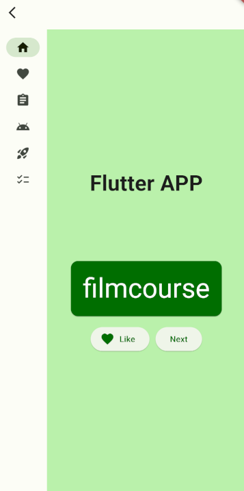

# 🌦️ Flutter in React Native - Hybrid Weather App

<div align="center">
  
  
  [](https://opensource.org/licenses/MIT)
  [](https://reactnative.dev/)
  [](https://flutter.dev/)
  [](https://www.typescriptlang.org/)
</div>

## 📑 Sumário

- [Sobre o Projeto](#-sobre-o-projeto)
- [Arquitetura](#-arquitetura)
- [Tecnologias](#-tecnologias)
- [Pré-requisitos](#-pré-requisitos)
- [Instalação](#-instalação)
- [Como Usar](#-como-usar)
- [Estrutura do Projeto](#-estrutura-do-projeto)
- [Scripts Disponíveis](#-scripts-disponíveis)
- [Desenvolvimento](#-desenvolvimento)
- [Contribuindo](#-contribuindo)
- [Licença](#-licença)

## 📖 Documentação Adicional

- **[⚡ Quick Start](QUICKSTART.md)** - Comece rapidamente em 5 minutos
- **[Guia de Instalação Completo](INSTALLATION.md)** - Setup detalhado do ambiente
- **[Arquitetura Detalhada](ARCHITECTURE.md)** - Design e padrões do projeto
- **[Changelog](CHANGELOG.md)** - Histórico de versões e mudanças
- **[Segurança](SECURITY.md)** - Políticas e práticas de segurança
- **[Contribuindo](CONTRIBUTING.md)** - Como contribuir com o projeto
- **[Código de Conduta](CODE_OF_CONDUCT.md)** - Regras da comunidade

## 🎯 Sobre o Projeto

Projeto de desenvolvimento híbrido que demonstra a integração de **Flutter** dentro de uma aplicação **React Native**. Este SDK permite incorporar módulos Flutter em apps React Native, possibilitando aproveitar o melhor dos dois mundos.

### ✨ Principais Recursos

- 🔄 Integração nativa entre React Native e Flutter
- 📱 Suporte para iOS e Android
- 🎨 Interface moderna e responsiva
- 🌐 Gerenciamento de estado com Provider (Flutter)
- 💾 Persistência local com Hive
- 🔌 Comunicação bidirecional entre as plataformas

## 🏗️ Arquitetura

```
┌─────────────────────────────────────────┐
│         React Native App                │
│  ┌───────────────────────────────────┐  │
│  │      JavaScript/TypeScript        │  │
│  │                                   │  │
│  │  ┌─────────────────────────────┐  │  │
│  │  │   Native Bridge Layer       │  │  │
│  │  │   (iOS Swift / Android)     │  │  │
│  │  └─────────────────────────────┘  │  │
│  │              ↕                    │  │
│  │  ┌─────────────────────────────┐  │  │
│  │  │   Flutter Module Engine     │  │  │
│  │  │   (Dart + Flutter Widgets)  │  │  │
│  │  └─────────────────────────────┘  │  │
│  └───────────────────────────────────┘  │
└─────────────────────────────────────────┘
```

### Fluxo de Comunicação

1. **React Native** → Native Module → **Flutter Engine**
2. Flutter renderiza suas views nativamente
3. **Flutter** → Event Channels → **React Native**

## 🛠️ Tecnologias

### React Native
- **React Native** 0.71.8
- **TypeScript** 4.5.2
- **React** 18.2.0
- React Native Builder Bob

### Flutter
- **Flutter SDK** 3.1.0+
- **Dart** 3.1.0+
- **Provider** (State Management)
- **Hive** (Local Storage)
- **HTTP** (Networking)

### Ferramentas
- Yarn 1.22.15
- CocoaPods (iOS)
- Gradle (Android)
- Lefthook (Git Hooks)
- Jest (Testing)
- ESLint + Prettier

## 📋 Pré-requisitos

### Sistema Operacional
- macOS (para desenvolvimento iOS)
- Linux ou Windows (para desenvolvimento Android)

### Ambiente React Native
- **Node.js** >= 16.0.0
- **Yarn** >= 1.22.15
- **Watchman** (recomendado)
- **JDK** 11 ou superior

### Ambiente Flutter
- **Flutter SDK** >= 3.1.0
- **Dart SDK** >= 3.1.0

### iOS
- **Xcode** >= 14.0
- **CocoaPods** >= 1.11.0
- iOS Simulator ou dispositivo físico

### Android
- **Android Studio** (ou Android SDK CLI tools)
- **Android SDK** >= 31
- Android Emulator ou dispositivo físico

## 🚀 Instalação

### 1. Clone o Repositório

```bash
git clone https://github.com/jonathasrochadesouza/flutter-in-react-weather
cd desenvolvimento-hibrido
```

### 2. Instale as Dependências

#### Dependências do Projeto Principal
```bash
yarn install
```

#### Dependências do Exemplo
```bash
cd example
yarn install
```

#### Dependências do Flutter Module
```bash
cd ../rn_flutter_sdk
flutter pub get
```

### 3. Instale as Dependências Nativas

#### iOS
```bash
cd ../example/ios
pod install
cd ../..
```

#### Android
As dependências Android são instaladas automaticamente durante o build.

### 4. (Opcional) Use o Script Bootstrap

```bash
# Na raiz do projeto
yarn bootstrap
```

## 💻 Como Usar

### Executar o Exemplo - Android

#### Opção 1: Via Yarn (Mais Simples)
```bash
cd example
yarn android
```

#### Opção 2: Via Scripts (Controle Manual)

**Terminal 1** - Iniciar Metro Bundler:
```bash
cd example
yarn start
```

**Terminal 2** - Build e executar (em outro terminal):
```bash
cd example
sh clean_android.sh    # Limpar build anterior
sh run_android.sh      # Executar no Android
```

Ou com permissões de execução:
```bash
chmod +x example/clean_android.sh
chmod +x example/run_android.sh
./example/clean_android.sh
./example/run_android.sh
```

### Executar o Exemplo - iOS

```bash
cd example
yarn ios
```

### Desenvolvimento com Hot Reload

```bash
# Terminal 1 - Metro Bundler
cd example
yarn start

# Terminal 2 - App
yarn android  # ou yarn ios
```

## 📁 Estrutura do Projeto

```
desenvolvimento-hibrido/
├── android/                    # Código nativo Android do módulo
│   └── src/main/
├── ios/                        # Código nativo iOS do módulo
├── src/                        # Código TypeScript do SDK
│   ├── index.tsx              # Ponto de entrada principal
│   └── NativeRnLoginSdk.ts    # Bridge nativo
├── rn_flutter_sdk/            # Módulo Flutter
│   ├── lib/
│   │   ├── main.dart          # Entry point Flutter
│   │   ├── models/            # Modelos de dados
│   │   ├── provider/          # Estado global
│   │   ├── screens/           # Telas Flutter
│   │   ├── services/          # Serviços (API, storage)
│   │   └── widgets/           # Componentes reutilizáveis
│   └── pubspec.yaml           # Dependências Flutter
├── example/                   # Aplicação de exemplo
│   ├── android/               # Build Android do exemplo
│   ├── ios/                   # Build iOS do exemplo
│   └── src/
│       ├── App.tsx            # Componente principal
│       └── components/        # Componentes React Native
├── lib/                       # Saída compilada (gerado)
└── scripts/                   # Scripts auxiliares
```

## 📜 Scripts Disponíveis

### Projeto Principal

```bash
yarn test                  # Executar testes
yarn typecheck            # Verificar tipos TypeScript
yarn lint                 # Executar linter
yarn clean                # Limpar builds
yarn bootstrap            # Instalar todas as dependências
yarn release              # Criar nova release
```

### Exemplo

```bash
yarn android              # Executar no Android
yarn ios                  # Executar no iOS
yarn start                # Iniciar Metro bundler
yarn test                 # Executar testes
```

## 👨‍💻 Desenvolvimento

### Adicionar Novas Funcionalidades

1. **Módulo Flutter**: Adicione suas telas/lógica em `rn_flutter_sdk/lib/`
2. **Bridge Nativo**: Atualize os arquivos em `android/` e `ios/`
3. **TypeScript**: Exponha a API em `src/index.tsx`

### Testar Mudanças

```bash
# Rebuild do módulo
yarn prepack

# Testar no exemplo
cd example
yarn start --reset-cache
yarn android  # ou ios
```

### Debug

#### React Native Debugger
```bash
# Shake o dispositivo/emulador
# Selecione "Debug" no menu
```

#### Flutter DevTools
```bash
flutter pub global activate devtools
flutter pub global run devtools
```

## 🤝 Contribuindo

Contribuições são bem-vindas! Por favor, leia [CONTRIBUTING.md](CONTRIBUTING.md) para detalhes sobre nosso código de conduta e processo de submissão de pull requests.

### Passos para Contribuir

1. Fork o projeto
2. Crie uma branch para sua feature (`git checkout -b feature/AmazingFeature`)
3. Commit suas mudanças (`git commit -m 'Add some AmazingFeature'`)
4. Push para a branch (`git push origin feature/AmazingFeature`)
5. Abra um Pull Request

## 📄 Licença

Este projeto está licenciado sob a Licença MIT - veja o arquivo [LICENSE](LICENSE) para detalhes.

---

<div align="center">
  
  
  
  
  Feito com ❤️ por Jonathas Rocha
  
</div>

